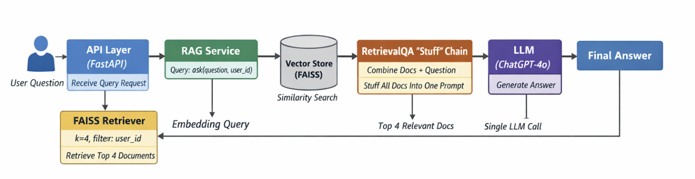

# Overview
This is a simple document search application that let the users to ask questions from the PDF contents.   
This RAG implementation showcases ingesting the text from PDFs into the in-memory vector store, how to retrieve the chunks, 
how to pass the question plus retrieved context to LLM

# Running the Document Query API
## Update the dependencies
pip install -r requirements.txt
## Update API Key
Update the OPENAI_API_KEY in .env file under root folder of this code 
## Make sure you have "docs" folder under the root project
## Run in local
uvicorn app.main:app --env-file .env --reload
## Code walkthrough Recording
https://drive.google.com/file/d/1Vyxk5K4sWgOd2tmK70Vt9TlprFiQbf8D/view?usp=sharing
